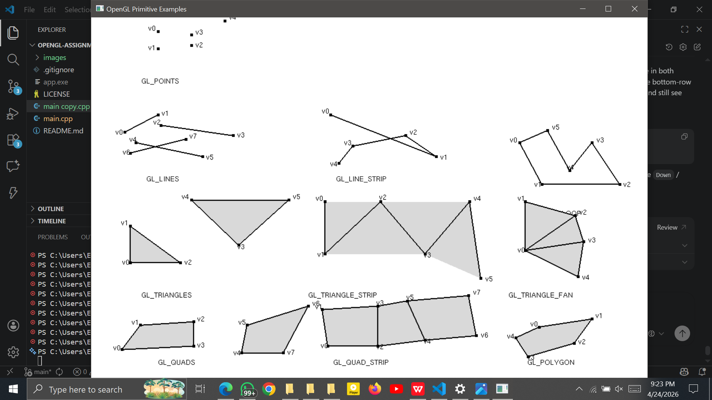
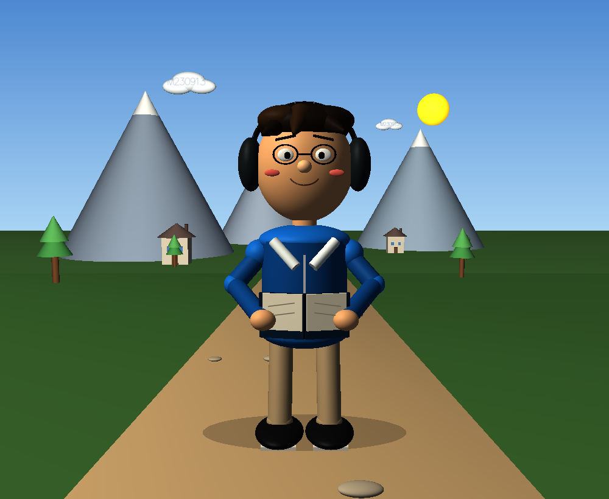
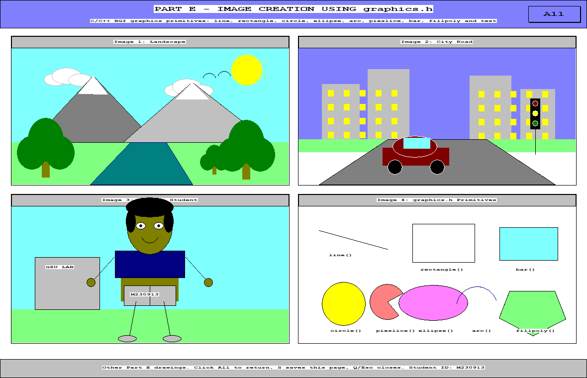
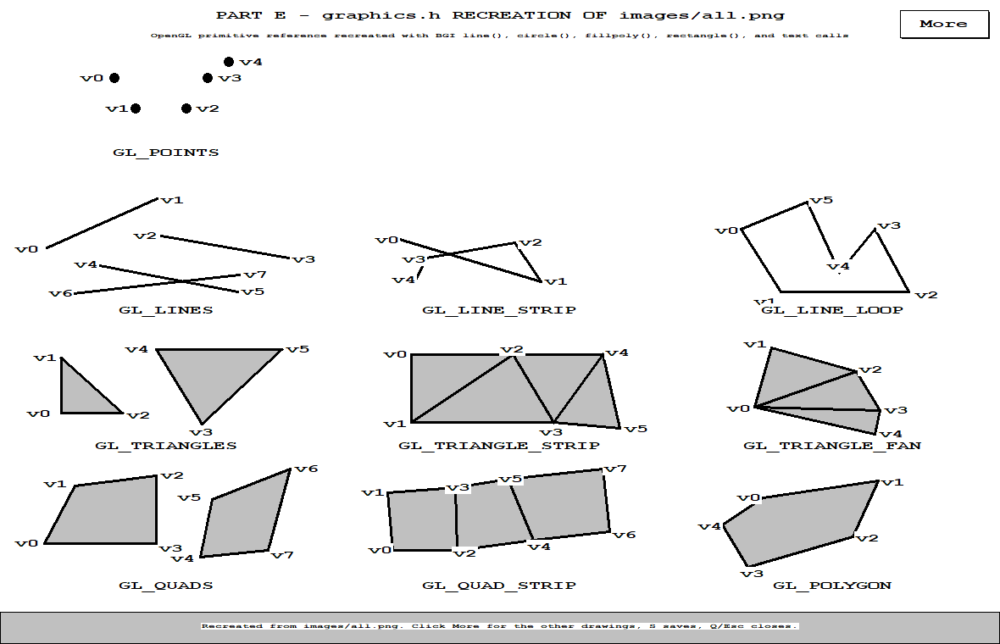
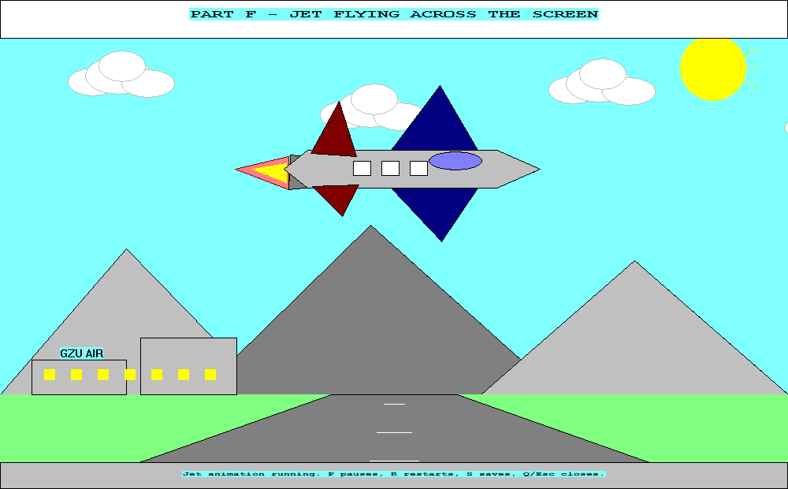

# OpenGL and Computer Graphics Assignment Submission

**Student:** Ezekiel Rego  
**Student Number:** M230913  
**Module Code:** ISH 407 / HCS411  
**Institution:** Great Zimbabwe University

## Live Showcase

- **Hosted assignment page:** [https://gl.applications.co.zw](https://gl.applications.co.zw)
- **Live primitive demo:** [https://gl.applications.co.zw/demos/primitives.html](https://gl.applications.co.zw/demos/primitives.html)
- **Live Part B demo:** [https://gl.applications.co.zw/demos/near-far.html](https://gl.applications.co.zw/demos/near-far.html)
- **Repository:** [https://github.com/ezekielrego/opengl](https://github.com/ezekielrego/opengl)

This repository contains my Computer Graphics assignment submission. The work is split into separate practical parts covering OpenGL primitive rendering, a 3D near/far-plane scene, and classic `graphics.h` image creation and animation tasks.

The hosted site includes live browser versions of the OpenGL primitive reference sheet and the Part B near/far-plane scene, alongside hosted output pages for the `graphics.h` sections.

## Submission Contents

### 1. OpenGL Primitive Types Reference

The top-level OpenGL program in [main.cpp](main.cpp) renders a lecturer-facing reference sheet showing how the main legacy OpenGL primitive types are formed from vertex coordinates.

Implemented primitives:

- `GL_POINTS`
- `GL_LINES`
- `GL_LINE_STRIP`
- `GL_LINE_LOOP`
- `GL_TRIANGLES`
- `GL_TRIANGLE_STRIP`
- `GL_TRIANGLE_FAN`
- `GL_QUADS`
- `GL_QUAD_STRIP`
- `GL_POLYGON`

**Screenshot**



**Live Demo**

[https://gl.applications.co.zw/demos/primitives.html](https://gl.applications.co.zw/demos/primitives.html)

### 2. Part B - 3D Cartoon Character Near/Far Plane

The project in [part_b_cartoon_character](part_b_cartoon_character) is a separate OpenGL/freeGLUT scene designed to demonstrate depth perception using a large foreground character and smaller background objects.

Highlights:

- 3D-style cartoon student character in the near plane
- Houses, mountains, trees, clouds, and sun in the far plane
- Lighting, depth testing, smooth shading, and perspective setup
- Keyboard interaction and screenshot saving

**Screenshot**



**Live Demo**

[https://gl.applications.co.zw/demos/near-far.html](https://gl.applications.co.zw/demos/near-far.html)

### 3. Part E - `graphics.h` Image Creation

The project in [part_e_graphics_h](part_e_graphics_h) uses WinBGIm `graphics.h` functions to draw multiple 2D scenes and a recreated primitive reference page.

It includes:

- a landscape image
- a city road image
- a cartoon student image
- a primitive demonstration page
- a `graphics.h` recreation of the OpenGL primitives sheet

**Screenshots**





**Hosted Output Page**

[https://gl.applications.co.zw/parts/part-e.html](https://gl.applications.co.zw/parts/part-e.html)

### 4. Part F - Jet Flying Across the Screen

The project in [part_f_jet_graphics_h](part_f_jet_graphics_h) is a `graphics.h` animation of a jet moving across a runway and sky background.

Features:

- animated jet movement
- background scenery and runway
- timer-based updates
- pause, restart, save, and exit controls

**Screenshot**



**Hosted Output Page**

[https://gl.applications.co.zw/parts/part-f.html](https://gl.applications.co.zw/parts/part-f.html)

## Files and Folders

- [main.cpp](main.cpp): main OpenGL primitive reference program
- [main copy.cpp](main%20copy.cpp): backup working copy
- [images](images): primitive reference images and output captures
- [part_b_cartoon_character](part_b_cartoon_character): Part B OpenGL/freeGLUT scene
- [part_e_graphics_h](part_e_graphics_h): Part E WinBGIm `graphics.h` work
- [part_f_jet_graphics_h](part_f_jet_graphics_h): Part F WinBGIm `graphics.h` animation

## Build Notes

### OpenGL/freeGLUT parts

The OpenGL programs were developed for freeGLUT. Example Windows build commands used in the assignment are included in the part-specific README files.

On Linux with freeGLUT and Mesa installed, the top-level program can be compiled with:

```bash
g++ main.cpp -o app -lglut -lGL -lGLU
```

### `graphics.h` parts

The `graphics.h` projects use vendored WinBGIm files and the provided PowerShell build scripts inside their folders.

## Controls

### Primitive reference program

- Mouse wheel: scroll
- `Up` / `Page Up`: scroll upward
- `Down` / `Page Down`: scroll downward

### Part B

- `W` / `Up Arrow`: small step forward
- `S` / `Down Arrow`: small step backward
- `A` / `Left Arrow`: rotate left with a small side step
- `D` / `Right Arrow`: rotate right with a small side step
- `R`: reset
- `P`: save screenshot
- `Q` or `Esc`: quit
