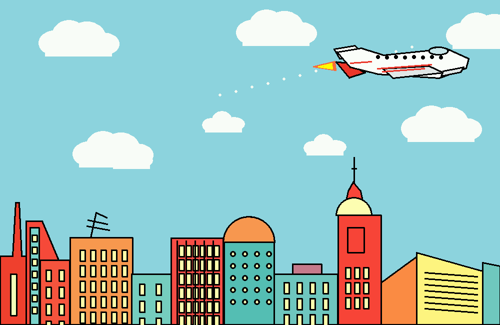

# Part E - Animated Jet City Scene

This is a separate `graphics.h` drawing that recreates the supplied cartoon city and airplane reference image using BGI primitives. The jet animates across the sky above the city.

## Files

- `part_e_jet_city_animation.cpp`: C++ source file for the animated drawing.
- `build.ps1`: build script using the vendored WinBGIm files from `part_e_graphics_h`.
- `part_e_jet_city_animation_output.bmp`: saved output image generated by the program.
- `part_e_jet_city_animation_output.png`: web-friendly preview of the saved output image.

## Screenshot



## Build

```powershell
.\build.ps1
```

## Run

```powershell
.\part_e_jet_city_animation.exe
```

## Controls

- `P`: pause or continue the animation.
- `R`: restart the jet from the left side.
- `S`: save the current frame as `part_e_jet_city_animation_output.bmp`.
- `Q` or `Esc`: close the program.

To save one frame automatically and close:

```powershell
.\part_e_jet_city_animation.exe --save-and-exit
```
